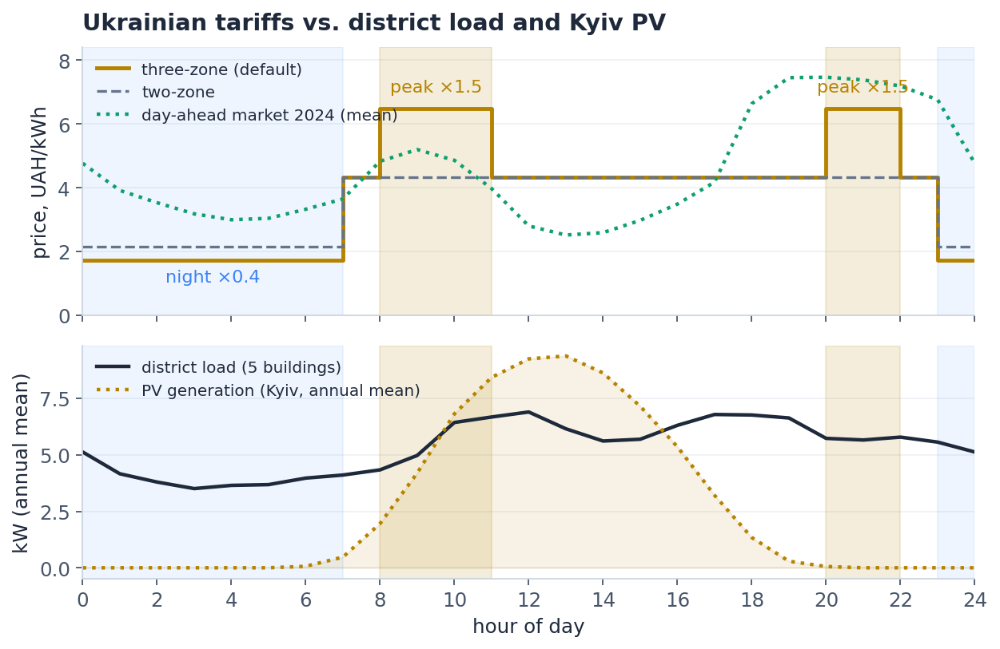
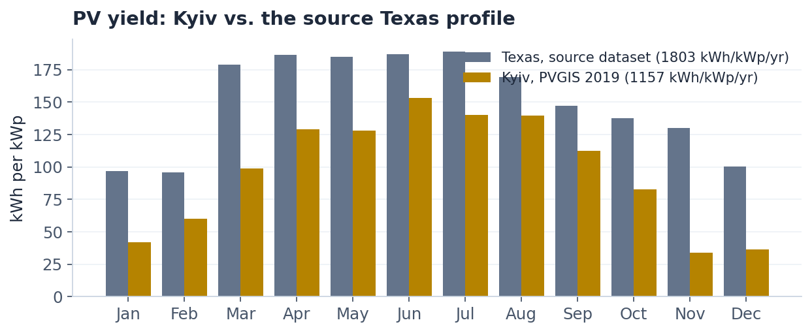
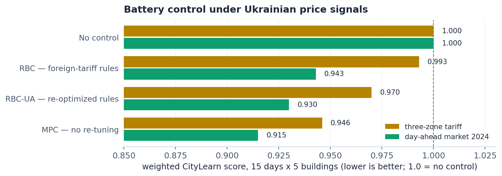
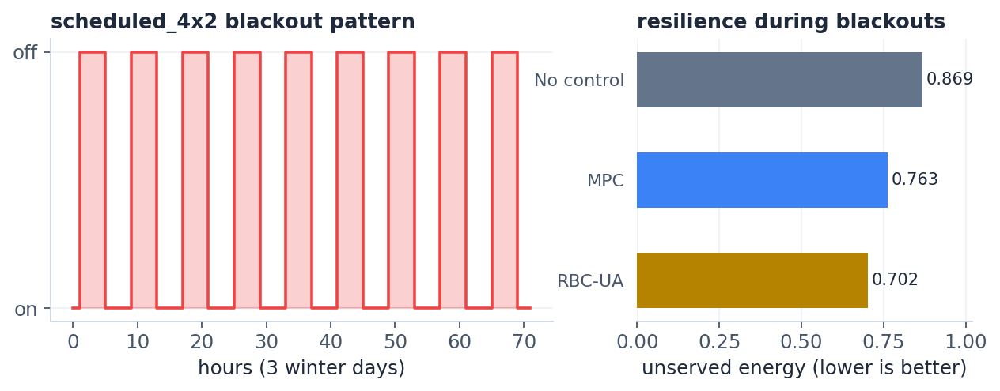

# CityLearn-UA

**A CityLearn-compatible benchmark for building energy control in the Ukrainian
energy context: real residential tariffs, real market prices, Kyiv solar, and
rolling blackouts.**

Built on the measured building load profiles of [CityLearn 2022](https://github.com/intelligent-environments-lab/CityLearn)
(17 residential buildings, 8760 hourly steps, 6.4 kWh battery + 5 kW inverter each),
with every price- and energy-side signal replaced by Ukrainian data. Drop-in
compatible with any code that runs CityLearn ≥ 2.1 — point `schema` at the dataset
and your existing forecaster, MPC, or RL agent runs against Ukrainian conditions.



Both the regulated evening peak (20:00–22:00, ×1.5) and the market's own evening
peak land exactly where district load is high and PV output is zero — that is the
window a battery controller has to win. Note how the market price (green) collapses
at midday when solar floods the grid, while the regulated tariff (amber) ignores it.

## What makes it Ukrainian

| Component | Source | Note |
|---|---|---|
| **Residential tariff** | current three-zone / two-zone TOU tariff | base 4.32 UAH/kWh, in force until 2026-10-31 |
| **Market prices** | [Market Operator](https://www.oree.com.ua) day-ahead market, full year 2024 | 8760 hourly prices, 0.01–9.00 UAH/kWh |
| **PV generation** | [PVGIS](https://joint-research-centre.ec.europa.eu/photovoltaic-geographical-information-system-pvgis_en) SARAH2, Kyiv 2019 | 1157 kWh/kWp/yr, 4.5× winter dip |
| **Blackouts** | stylised rolling-blackout schedule (4h off / 4h on, Nov–Mar) | plus a stochastic fault model |
| Building load, weather, carbon | CityLearn 2022 (Texas) | unchanged — see Limitations |



## Why this dataset exists

Tariff structure and solar resource are not details — they *are* the objective
function and the physics. Controllers tuned in one context can lose money in
another: in our benchmark, a rule schedule Bayesian-optimized for the source
(single-evening-peak, sun-rich) context charges batteries straight into the
Ukrainian **morning** peak. And a cost-optimal controller can be a *worse* choice
when the grid goes down. CityLearn-UA lets you measure both effects on realistic
profiles with real, currently effective Ukrainian signals.

## Tariff and price variants

Residential base price **4.32 UAH/kWh**; zone boundaries follow the official
multi-zone metering rules.

| Variant | File | Night 23:00–07:00 | Peaks 08:00–11:00, 20:00–22:00 | Other hours |
|---|---|---|---|---|
| **Three-zone** (default) | `pricing.csv` | ×0.4 → **1.728** | ×1.5 → **6.48** | 4.32 |
| Two-zone | `pricing_two_zone.csv` | ×0.5 → **2.16** | — | 4.32 |
| Flat (control condition) | `pricing_flat.csv` | 4.32 | 4.32 | 4.32 |
| **Day-ahead market 2024** | `pricing_dam.csv` | hourly, mean 4.53, range 0.01–9.00 | | |

To switch, overwrite the default:
`cp data/citylearn_ua/pricing_dam.csv data/citylearn_ua/pricing.csv`.

Because both the tariff and the day-ahead auction are known a day in advance, the
`*_predicted_{6h,12h,24h}` columns are exact forward shifts — load and PV still
have to be forecast, prices do not.

## Quickstart

```bash
pip install "citylearn>=2.1" pandas numpy
python examples/quickstart.py
```

Expected output (no-control baseline vs. a simple hand-written three-zone rule,
15 days × 5 buildings):

```
                           import, kWh   cost, UAH
no control                        1582        6082
three-zone rule                   1694        5582

savings: 500 UAH (8.2%) over 15 days, 5 buildings
```

Using the dataset from your own code is one line:

```python
from citylearn.citylearn import CityLearnEnv
env = CityLearnEnv(schema="data/citylearn_ua/schema.json", central_agent=True)
```

## Benchmark results

Weighted CityLearn score (lower is better, 1.0 = no control), 15 days × 5
buildings, controllers from the companion DistrictEMS platform:



| Controller | Three-zone tariff | Day-ahead market |
|---|---|---|
| No control | 1.000 | 1.000 |
| RBC — hourly rules optimized for the source context | 0.993 | 0.943 |
| RBC-UA — same rules re-optimized here (ES, ~200 evals) | 0.970 | 0.930 |
| **MPC — zero re-tuning, prices read as input** | **0.946** | **0.915** |

In money, against no control: MPC saves 7.0% of the import bill under the
regulated tariff and 16.9% under market prices, and cuts peak-hour import by
20.5% / 31.9%. Rule-based control recovers part of that only after being
re-optimized for the new context — and its re-optimized schedule is then tied to
that context again.

## Resilience under blackouts

The `scheduled_4x2` scenario applies a rolling 4h-off / 4h-on blackout through the
heating season (Nov–Mar, 20.7% of the year, synchronous district-wide — a district
is switched as one feeder queue). During an outage a building runs on PV + battery
only; CityLearn reports the share of demand it could not serve.



| Controller | Unserved energy | Mean SoC when the blackout starts |
|---|---|---|
| No control | 0.869 | 0.00 |
| MPC (cost-optimal) | 0.763 | 0.14 |
| **RBC-UA (fixed schedule)** | **0.702** | **0.21** |

**The cost-optimal controller is not the resilience-optimal one.** MPC empties the
battery whenever holding charge has no price value, so it enters blackouts with 35%
less stored energy than the naive rule schedule and serves less load. Designing for
both objectives at once — cost with a state-of-charge reserve — is the open problem
this scenario exists to benchmark.

## Rebuilding from scratch

```bash
python scripts/build_dataset.py data/citylearn_ua                       # default: Kyiv PV
python scripts/build_dataset.py data/citylearn_ua --pv texas            # climate as a variable
python scripts/build_dataset.py data/citylearn_ua --outages scheduled_4x2
python scripts/fetch_dam_prices.py --year 2024   # refresh market prices (needs network)
python scripts/make_figures.py                   # regenerate assets/
```

Raw inputs (`data/raw/`) are committed, so a rebuild is offline and byte-identical.

## Repository layout

```
data/citylearn_ua/            the dataset (schema, 17 building CSVs, weather,
                              carbon intensity, four pricing variants)
data/raw/                     cached upstream inputs: PVGIS Kyiv year,
                              consolidated Market Operator DAM prices 2024
scripts/build_dataset.py      deterministic generator (CityLearn 2022 -> CityLearn-UA)
scripts/fetch_dam_prices.py   Market Operator hourly DAM price fetcher
scripts/make_outage_schedules.py  blackout scenarios (deterministic + stochastic)
scripts/make_figures.py       README figures
examples/quickstart.py        baseline vs. simple tariff-aware rule, plain CityLearn
```

## Limitations

- **Building load profiles are Texas measurements** — consumption habits and the
  heating/cooling mix differ from Ukraine. Prices, solar, and blackouts are the
  Ukrainian components; load is not. No open hourly Ukrainian building dataset
  exists to replace it.
- Carbon intensity is the source dataset's series — read CO₂ results as a relative
  indicator, not as an estimate for the Ukrainian grid.
- PVGIS timestamps are converted at a fixed UTC+2; daylight saving is not modelled
  (up to a one-hour summer shift).
- The blackout schedule is stylised, not a log of actual outages; real queues varied
  by region, day, and hour.
- `CostFunction.cost` in CityLearn clips negative per-step cost to zero, so PV export
  revenue is not credited. Ukrainian day-ahead prices in 2024 never went negative,
  so this affects export revenue only.
- 2024 is a leap year: 29 February is dropped to keep 8760 steps, and the single
  DST-missing hour is filled with the preceding price.

## License and attribution

MIT (see `LICENSE`). Building profiles, weather, and carbon data originate from the
MIT-licensed [CityLearn](https://github.com/intelligent-environments-lab/CityLearn)
project — please cite it alongside this dataset:

> Vázquez-Canteli J.R., Kämpf J., Henze G., Nagy Z. *CityLearn v1.0: An OpenAI Gym
> environment for demand response with deep reinforcement learning.* BuildSys 2019.

Price data © [JSC "Market Operator"](https://www.oree.com.ua) (public reports);
solar data from the European Commission's PVGIS.

## Citation

See `CITATION.cff`, or:

> Voitekh D. *CityLearn-UA: a CityLearn-compatible benchmark for building energy
> control in the Ukrainian energy context.* 2026.
> https://github.com/dvoitekh/citylearn-ua
